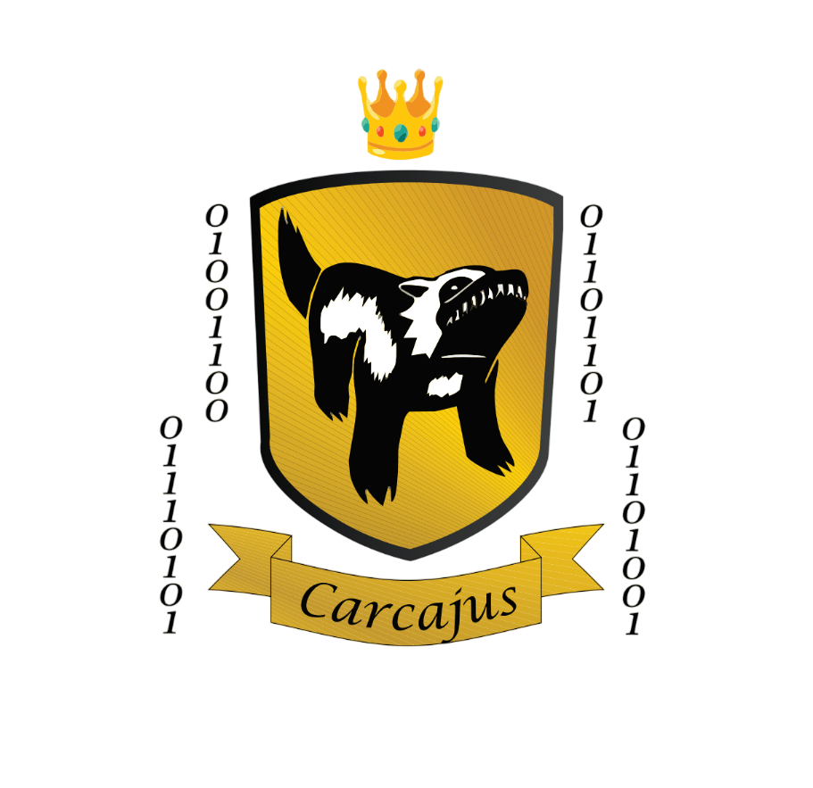

  <H1>Aprendizado de Máquina - Trabalho Final</H1>
  <H3>Prof.º Daniel Roberto Cassar</H3> 

 

  <H3>Guilda: Carcajus</H3>
  <H4>Aniel Souza Ribeiro Neto</H4>
  <H4>Caio Cogo Beriam</H4>
  <H4>Joaquim Junior Ferola Fonseca</H4>

  

  

# 📜 Introdução 

Repositório para o trabalho final da disciplina Aprendizado de Máquina do curso de graduação em Ciência e Tecnologia da Ilum Escola de Ciência.

O trabalho consiste no estudo de algoritmos de aprendizado de máquina 
